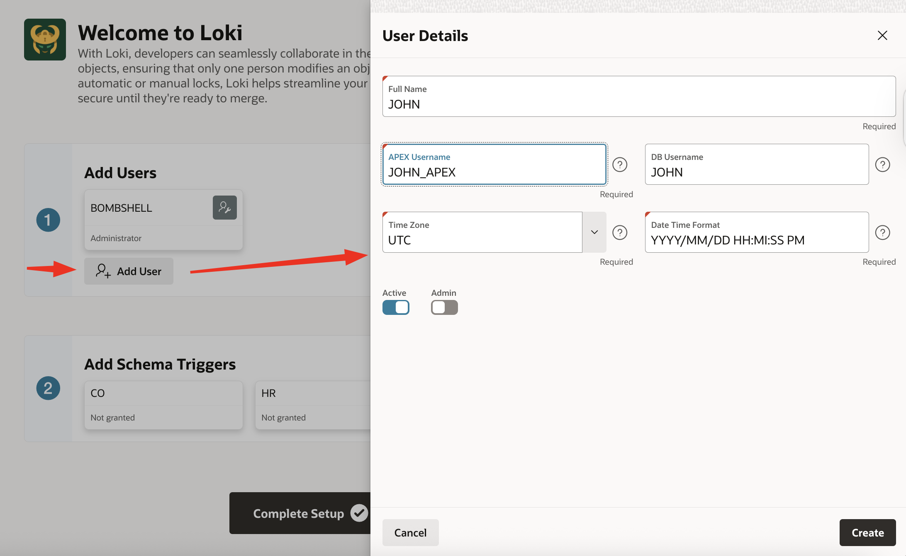
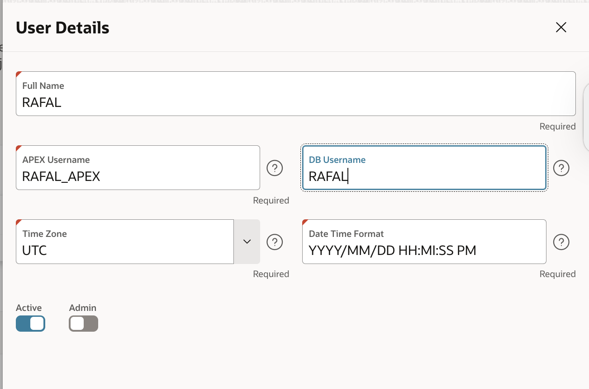
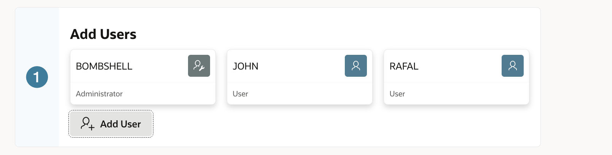
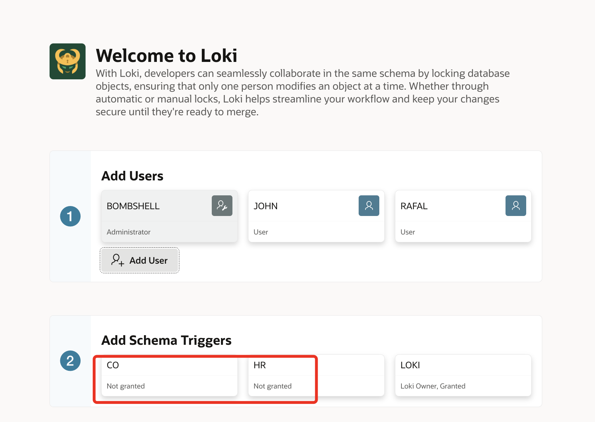
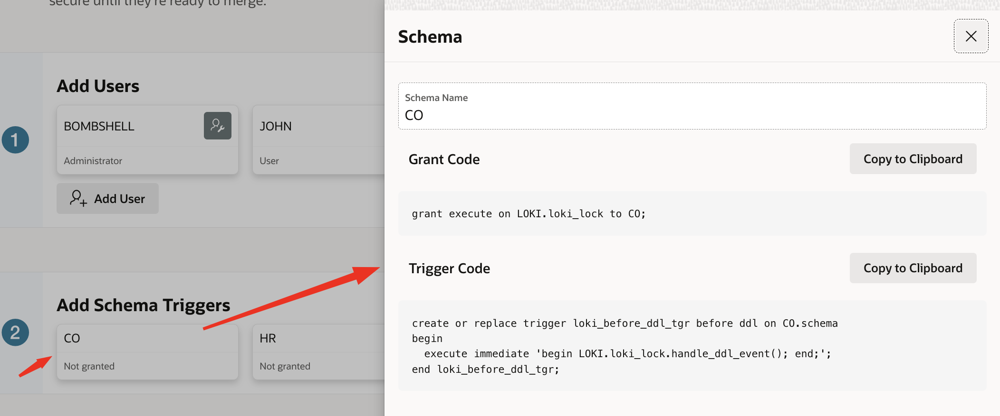
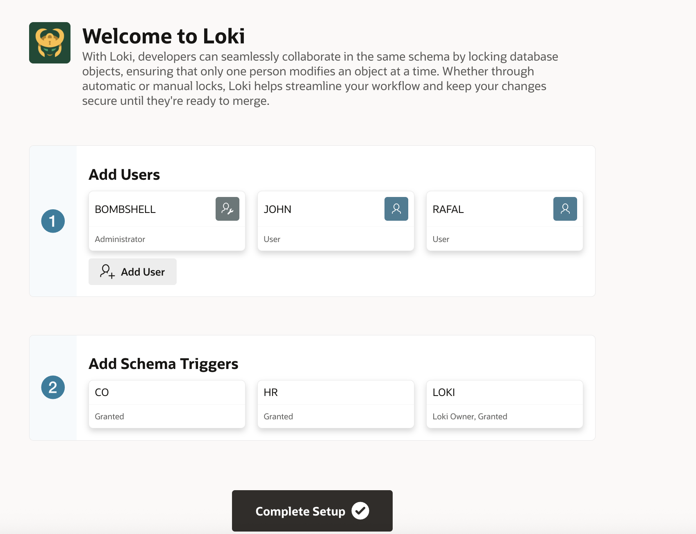

# Important

LOKI app was originaly created by Oracle and it's older version is available here -> 
https://github.com/oracle/apex/tree/24.1/utility-apps/loki

In this repository I upgraded it, moved to APEXlang, and added some features I was missing.


# LOKI

If you want to learn about LOKI by reading my blog, see [Who Changed My Code? No More Code Conflicts in Shared Oracle DB Dev Environments (LOKI)](https://rafal.hashnode.dev/who-changed-my-code-no-more-code-conflicts-in-shared-oracle-db-dev-environments-loki).

## Installation

### 1. Create LOKI Schema

Log in as an `ADMIN` or another privileged user, then create the `LOKI` user and grant required privileges:

```sql
create user loki;
grant create table to loki;
grant unlimited tablespace to loki;
grant create procedure to loki;
grant create job to loki;
grant create session to loki;
alter user loki identified by <password>>
```

### 2. Add LOKI Schema to Your APEX Workspace

```sql
begin
  apex_instance_admin.add_schema(
    p_workspace => 'DEMO',
    p_schema    => 'LOKI'
  );
end;
/
```

### 3. Install LOKI APEX App with Supporting Objects

Run script install.sql (adjust workspace name if needed)

Script should be executed as a user with privileges to install APEX apps in the workspace. E.g. DEMO in my case

### 4. Configure LOKI

After installing the LOKI app, log in as an `ADMIN` user and configure:

1. Add users







2. Add schema triggers





Execute the following as `ADMIN`:

```sql
grant execute on LOKI.loki_lock to CO;
grant execute on LOKI.loki_lock to HR;

create or replace trigger co.loki_before_ddl_tgr before ddl on CO.schema
begin
  execute immediate 'begin LOKI.loki_lock.handle_ddl_event(); end;';
end loki_before_ddl_tgr;
/

create or replace trigger hr.loki_before_ddl_tgr before ddl on HR.schema
begin
  execute immediate 'begin LOKI.loki_lock.handle_ddl_event(); end;';
end loki_before_ddl_tgr;
/
```

Run the LOKI application again, verify the settings, and click `Complete setup`.



For full configuration details, see [LOKI Installation and Configuration: No More Code Conflicts in the Shared Oracle Dev Database](https://rafal.hashnode.dev/loki-installation-and-configuration-no-more-code-conflicts-in-the-shared-oracle-dev-database).
